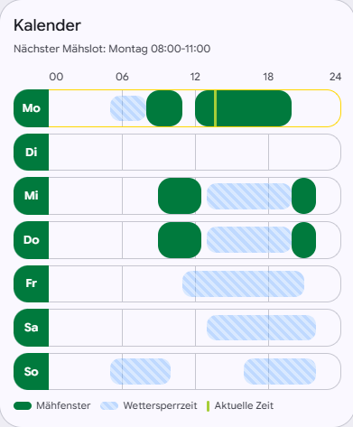

<table>
<tr>
<td width="140">


</td>
<td>

# Bosch Indego Calendar Card

A custom Home Assistant Lovelace card for visualizing Bosch Indego mowing schedules as a weekly calendar.

</td>
</tr>
</table>


[](https://github.com/sander1988/indego)

[](https://hacs.xyz/)
[](https://github.com/kimzeuner/Bosch-Indego-Calendar-Card/blob/main/LICENSE)
[](https://www.paypal.me/KZeuner)

---

## Overview

Supports both the classic Indego `*_calendar_slots` entities and the SmartMowing `*_predictive_schedule` entities.
Fully theme-aware, localized in English and German, and comes with a built-in Lovelace visual editor.



---

## Features

- **Weekly schedule grid** — multiple mowing windows per day
- **SmartMowing support** — predictive schedule + weather exclusion overlay
- **Current time indicator** — always know where you are in the week
- **Today highlight** — optional colored border on the current day row
- **Next mow subtitle** — automatic detection of the upcoming mowing slot
- **Tooltips** — on mowing windows and weather exclusions
- **Built-in legend** — color key rendered directly in the card
- **Visual editor** — configure without writing YAML
- **Localization** — English and German
- **Flexible color input** — CSS names, HEX, RGB/RGBA, theme variables

---

## Supported Entities

### Calendar Slots

```yaml
monday_slot_1: 08:00–12:00
monday_slot_2: 14:00–16:00
```

### SmartMowing Predictive Schedule

```yaml
schedule_monday: 08:00–11:00, 12:00–20:00
exclusion_monday_weather: 05:00–08:00
next_mow_slot: Monday 08:00–11:00
```

---

## Installation

### Via HACS (Recommended)

1. Open **HACS** → **Frontend**
2. Click the three-dot menu → **Custom Repositories**
3. Add repository: https://github.com/kimzeuner/Bosch-Indego-Calendar-Card
Category: **Dashboard**
4. Install **Bosch Indego Calendar Card**
5. Hard-refresh your browser (`Ctrl+Shift+R`)

### Manual

1. Copy `indego-calendar-card.js` to `/config/www/`
2. Add a dashboard resource:
```yaml
   url: /local/indego-calendar-card.js
   type: module
```

---

## Configuration

### Minimal

```yaml
type: custom:indego-calendar-card
entity: sensor.indego_calendar_slots
```

### Full Example

```yaml
type: custom:indego-calendar-card
entity: sensor.indego_predictive_schedule
title: SmartMowing Calendar
highlight_today: true
show_weather_exclusions: true
show_next_mow: true
show_legend: true
day_color: var(--primary-color)
day_text_color: white
slot_color: "#007a3d"
weather_exclusion_color: rgba(80, 160, 255, 0.35)
now_color: orange
today_border_color: gold
```

### Options

| Option | Default | Description |
|---|---|---|
| `entity` | **required** | Calendar or predictive schedule entity |
| `title` | `Calendar` | Card title |
| `day_color` | `#007a3d` | Day label background color |
| `day_text_color` | `#ffffff` | Day label text color |
| `slot_color` | `#007a3d` | Mowing window fill color |
| `weather_exclusion_color` | `rgba(80,160,255,0.35)` | Weather exclusion overlay color |
| `now_color` | `#a6ce39` | Current time indicator color |
| `today_border_color` | `#ffd700` | Border color for the current day |
| `highlight_today` | `false` | Highlight the current day row |
| `show_weather_exclusions` | `true` | Show weather exclusion overlays |
| `show_next_mow` | `true` | Show next mowing slot subtitle |
| `show_legend` | `true` | Show the built-in legend |

---

## Color Formats

All standard CSS color formats are supported, including Home Assistant theme variables:

```yaml
day_color: blue
day_color: "#007a3d"
day_color: rgb(0, 122, 61)
day_color: rgba(0, 122, 61, 0.5)
day_color: var(--primary-color)
day_color: primary-color       # shorthand — resolved automatically
day_color: --primary-color     # also valid
```

---

## Compatibility

| Component | Version |
|---|---|
| Home Assistant | 2026.6.x |
| Bosch Indego Integration | latest |

---

## License

Released under the [MIT License](LICENSE).
